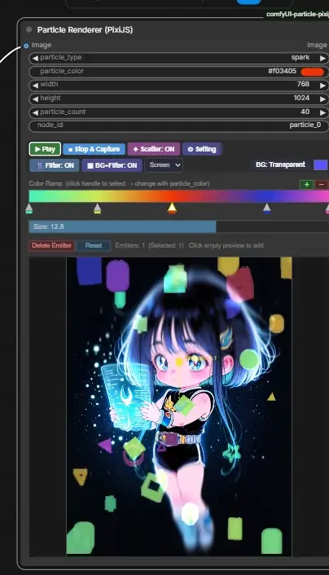
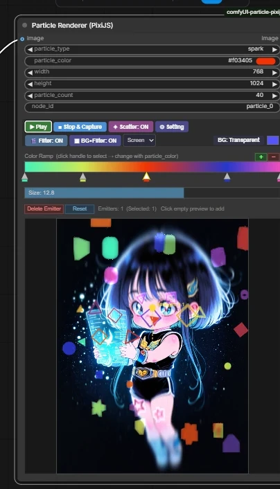
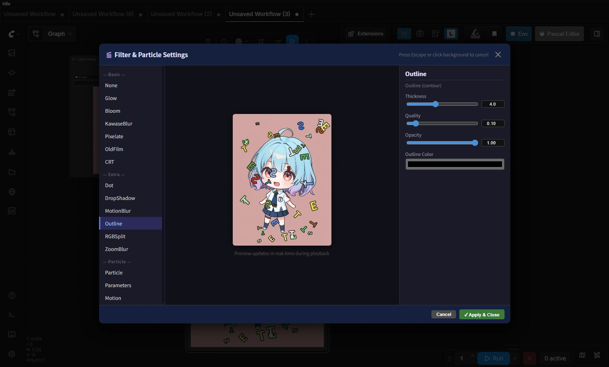
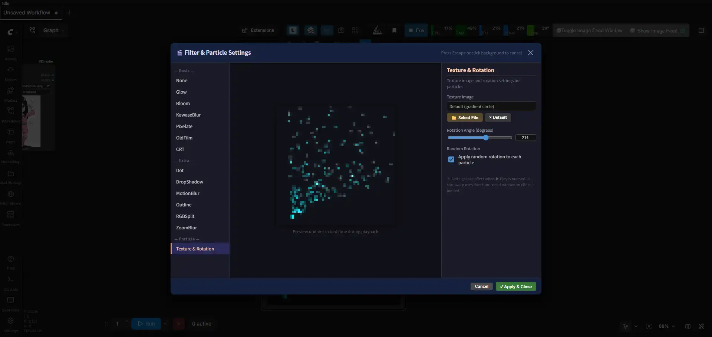

# ComfyUI Particle Renderer (PixiJS)

ComfyUI 上でリアルタイムパーティクルアニメーションを描画し、任意のフレームをキャプチャして画像として出力するカスタムノードです。  
PixiJS v7 をベースに、煙・火花・光線・スターワープの4種類のパーティクルと29種類のポストエフェクトフィルター、ブレンドモード切り替えを搭載しています。英字・数字・記号をパーティクルシェイプとして使用する機能やキャンバス全面散布モードも備えています。

---

## デモ



---

## スクリーンショット

### ノード全体



### フィルターライブラリ



### Particle パネル（テクスチャ・シェイプ・文字シェイプ）



---

## 機能

### パーティクルタイプ

| タイプ | 説明 |
|--------|------|
| `none` | パーティクルなし（フィルター適用目的等に使用） |
| `smoke` | 煙 — ゆっくり広がる煙状のパーティクル |
| `spark` | 火花 — 重力に従って落下する火花 |
| `ray` | 光線 — 放射状に広がる光の粒 |
| `star_warp` | スターワープ — 奥行き感のある星空ワープ演出 |

### フィルター（13種類）

**Basic**
- **Glow** — 発光エフェクト
- **Bloom** — ブルームエフェクト
- **KawaseBlur** — 高速ブラー
- **Pixelate** — ピクセル化
- **OldFilm** — 古いフィルム風（セピア・ノイズ・傷・ビネット）
- **CRT** — CRTモニター風

**Extra**
- **Dot** — ハーフトーン（ドット）
- **DropShadow** — ドロップシャドウ
- **MotionBlur** — モーションブラー
- **Outline** — 輪郭線
- **RGBSplit** — 色収差（RGB分離）
- **ZoomBlur** — ズームブラー

### その他の機能

- **カラーグラデーション** — マルチストップのカラーランプでパーティクルの色を自由に設定
- **複数発生点** — プレビューをクリックして発生点を追加、ドラッグで移動
- **発生点の方向・強さ** — 矢印ハンドルをドラッグして向きと強さを調整
- **全面散布モード** — キャンバス全体にランダムにパーティクルを発生させるトグルモード
- **カスタムテクスチャ** — 任意の画像ファイルをパーティクルの形状として使用（複数登録・ランダム選択）
- **文字シェイプ** — アルファベット・数字・記号（48種）をパーティクルシェイプとして指定
- **パーティクル回転** — 固定角度またはランダム回転
- **ブレンドモード** — Default / Normal / Add / Multiply / Screen から選択
- **背景色** — 透明・単色背景の切り替え
- **BG+フィルタモード** — 入力画像とパーティクルをまとめてフィルター処理
- **i18n対応** — 日本語 / English / 中文（ComfyUI の言語設定に自動追従）

---

## インストール

### 方法 1 — ComfyUI Manager（推奨）

ComfyUI Manager から `comfyUI-particle-pixijs` を検索してインストール。

### 方法 2 — 手動インストール

```bash
cd ComfyUI/custom_nodes
git clone https://github.com/ketle-man/comfyUI-particle-pixijs
```

ComfyUI を再起動するとノードが認識されます。

---

## 使い方

### 基本的な使用フロー

1. ノードパネルの **Add Node → image/effects → Particle Renderer (PixiJS)** からノードを追加
2. パラメーターを設定（パーティクルタイプ・色・サイズ・数など）
3. **▶ Play** ボタンでアニメーションを開始
4. 好みのフレームで **■ Stop & Capture** を押してキャプチャ
5. **Run** または **Queue Prompt** でキャプチャ画像が ComfyUI の出力として送出される

### ノードパラメーター

| パラメーター | 説明 |
|-------------|------|
| `particle_type` | パーティクルの種類（none / smoke / spark / ray / star_warp） |
| `particle_color` | カラーランプの選択中ストップの色 |
| `width` / `height` | キャンバスサイズ（64〜2048px） |
| `particle_count` | パーティクル総数（10〜2000） |
| `node_id` | 複数ノードを区別するための一意なID |
| `image`（オプション） | 背景として合成する入力画像 |

### カラーランプ

- ストップをクリックして選択 → `particle_color` ウィジェットで色を変更
- **+** ボタンでストップを追加、**−** ボタンで削除
- ストップをドラッグして位置を調整

### 発生点の操作

| 操作 | 動作 |
|------|------|
| プレビュー内の空きクリック | 新しい発生点を追加 |
| 発生点（丸マーク）をドラッグ | 発生点を移動 |
| 矢印の先端をドラッグ | 方向・強さを変更 |
| **Delete Emitter** | 選択中の発生点を削除（1個のみの場合は中央にリセット） |
| **Reset** | すべての発生点を削除し、発生点1を中央に配置 |

### フィルターライブラリ

**🎬 Filter Library** ボタンをクリックして開きます。

- 左列でフィルターまたはパネルを選択
- 中央でリアルタイムプレビュー（再生中は自動更新）
- 右列でパラメーターを調整
- **✓ Apply & Close** で確定、**Cancel** で破棄

左列の構成:

| 項目 | 内容 |
|------|------|
| None / Glow / Bloom / … | ポストエフェクトフィルターの選択 |
| **Particle** | テクスチャ・シェイプ・文字シェイプの設定 |
| **Parameters** | 速度・寿命・サイズ・広がりなどのパーティクルパラメーター |
| **Motion** | 乱気流・風・渦（モーション設定） |

**Particle パネル** では以下のパラメーターを設定できます：

| 項目 | 説明 |
|------|------|
| **Size** | パーティクルの基本サイズ（1.0〜30.0） |
| **Spread** | 放出角度の広がり倍率（0.1〜5.0）。大きいほど扇状に広がる |
| **テクスチャ** | カスタム画像ファイルをパーティクルシェイプとして使用 |
| **シェイププリセット** | 円・星・ダイヤモンドなどのプリセット形状 |
| **文字シェイプ** | アルファベット・数字・記号（48種）をシェイプとして指定 |

**Motion パネル** では以下のパラメーターを設定できます：

| 項目 | 説明 |
|------|------|
| **Turbulence** | 乱気流の強さ |
| **Turb Freq** | 乱気流の空間周波数 |
| **Wind X / Wind Y** | 水平・垂直方向の風力 |
| **Swirl** | 渦の強さ |

### 全面散布モード

上段の **✦ 全面散布** ボタンで、キャンバス全体にランダムにパーティクルを発生させるモードに切り替えられます。

- ON（紫色）: エミッター発生点を無視し、キャンバス全面にランダム配置
- OFF（暗色）: 通常の発生点からの放出（デフォルト）

> `star_warp` タイプは独自の3D座標系を使用するため、全面散布モードは適用されません。

---

### 文字シェイプ

フィルターライブラリの **Particle** パネル下部でアルファベット・数字・記号をパーティクルの形状として指定できます。

- **テキストボックス**: カンマ区切りで文字を入力（例: `A,B,!,★`）。英数字・記号・Unicode 対応
- **[A-Z]** ボタン: アルファベット大文字 A〜Z を一括入力
- **[0-9]** ボタン: 数字 0〜9 を一括入力
- **[!?#:]** ボタン: 記号48種を一括入力（`! " # $ % & ' ( ) * + - . / : ; < = > ? @ [ \ ] ^ _ ` { | } ~` + `★ ☆ ♪ ♥ ♦ ♣ ♠ → ← ↑ ↓ ≠ ≤ ≥ ± ∞ ×`）
- **[× Clear]** ボタン: 文字シェイプ設定をクリア

文字シェイプが設定されている場合の優先順は `カスタムテクスチャ > 文字シェイプ > プリセットシェイプ` です。

---

### ブレンドモード

BG+Filter ボタンの右隣のドロップダウンから、パーティクルのブレンドモードを変更できます。

| 選択肢 | 動作 |
|--------|------|
| **Default** | 各パーティクルタイプの標準値（smoke=Normal、spark/ray/star_warp=Add） |
| **Normal** | 通常合成（標準的な重ね描き） |
| **Add** | 加算合成（明るく発光する演出に） |
| **Multiply** | 乗算合成（暗め・影のような演出に） |
| **Screen** | スクリーン合成（柔らかい発光に） |

### BG+フィルタモード

**■ BG+Filter** ボタンで入力画像とパーティクルをまとめてフィルター処理します。

> **フィルターの適用範囲について**: BG+Filter: OFF の場合はパーティクルレイヤーのみにフィルターが適用されます。BG+Filter: ON の場合は**パーティクルレイヤーと背景画像にそれぞれ個別にフィルターが適用**されます（同一インスタンスを共有すると PixiJS 内部で競合するため、毎回別インスタンスを生成して割り当てます）。例外として **Godray** は出力全体を不透明化する全面エフェクト型のため、BG+Filter の設定にかかわらず常に画面全体（背景画像含む）に適用されます。

**使用手順**:
1. `image` 入力に画像ノードを接続
2. **■ BG+Filter** を ON にする
3. **▶ Play** でアニメーション開始（背景画像の更新が必要な場合は自動的に Queue Prompt を実行してから背景をロードします）
4. **■ Stop & Capture** でキャプチャ

### テクスチャ設定

フィルターライブラリの **Particle** から設定します。

- **📁 Select File** — 画像ファイルを追加（複数選択可）。追加したテクスチャはリストに蓄積され、パーティクル生成時にランダムで選択されます
- **× Default** — テクスチャリストを全てクリアし、デフォルト（グラデーション円形）に戻す
- **× ボタン（各アイテム）** — 個別のテクスチャを削除

#### テクスチャ画像の推奨仕様

| 項目 | 推奨値 | 理由 |
|------|--------|------|
| サイズ | **64×64 〜 256×256 px** | GPU テクスチャとして扱われるため、大きすぎると VRAM を圧迫 |
| 形状 | **正方形**（1:1） | PixiJS が内部でテクスチャアトラスに配置する際に効率的 |
| 2の累乗 | **推奨**（64/128/256） | GPU ハードウェアとの相性が良く、描画効率が高い |
| フォーマット | **PNG / WebP** | アルファチャンネル（透明度）が使えるため、形状の輪郭が滑らか |
| 背景 | **透明（アルファあり）** | 黒背景のテクスチャだと矩形の枠がパーティクルに見える |
| 色 | **白またはグレースケール** | パーティクルカラー（カラーランプ）で色が乗算されるため、白で描くと指定色が正確に反映される |

> **複数テクスチャを追加した場合**、パーティクル1粒ごとにリストからランダムに選択されます。バリエーションのある演出に活用できます。

---

## 注意事項

- **node_id** は同一ワークフロー内で一意になるよう設定してください（デフォルト: `particle_0`）。複数のノードを使用する場合は `particle_1`、`particle_2` のように別の値を指定してください。
- PixiJS および pixi-filters は拡張内（`web/lib/`）に同梱されており、ローカルから自動ロードされます。インターネット接続は不要です。
- キャプチャ画像はサーバー再起動までメモリに保持されます。
- パーティクル設定（テクスチャ、回転など）は **▶ Play** を押したタイミングで反映されます。
- **BG+Filter モード**は ▶ Play 押下時に背景画像の更新が必要な場合、自動的に Queue Prompt を実行して背景をロードします。

---

## 動作要件

- ComfyUI（最新版推奨）
- Python 3.10 以上
- WebGL 対応ブラウザ（PixiJS の描画に使用）

PixiJS / pixi-filters は拡張内に同梱されているため、インターネット接続は不要です。Python 側の追加依存パッケージもありません。

---

## ライセンス

MIT License
